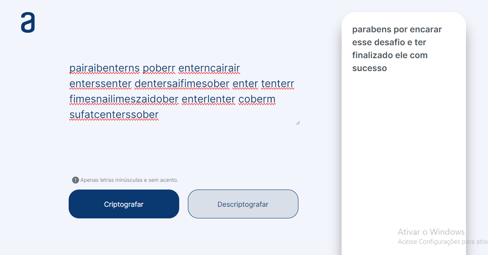

Desafio Oracle/Alura

## Decodificador / Codificador de texto

As "chaves" de criptografia que utilizaremos são: 
A letra "e" é convertida para "enter" 
A letra "i" é convertida para "imes" 
A letra "a" é convertida para "ai" 
A letra "o" é convertida para "ober" 
A letra "u" é convertida para "ufat" 

